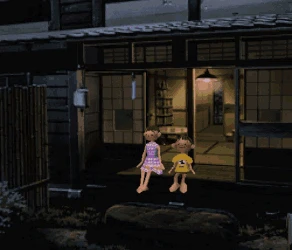

 

<source media="(prefers-color-scheme: light)" srcset="https://pixel-profile.vercel.app/api/github-stats?username=muradpontes&screen_effect=true&dithering=true&include_all_commits=true&pixelate_avatar=true&theme=crt&theme=crt&color=%23ffffffFF&hide=contributions%2Crank%2Cprs%2Cissues">

## stacks

  
  
  
  
  
  
  
  
  
  

  
  
  
  
  
  
  
  
  

## onde me encontrar ##

## ouvindo ##

  

